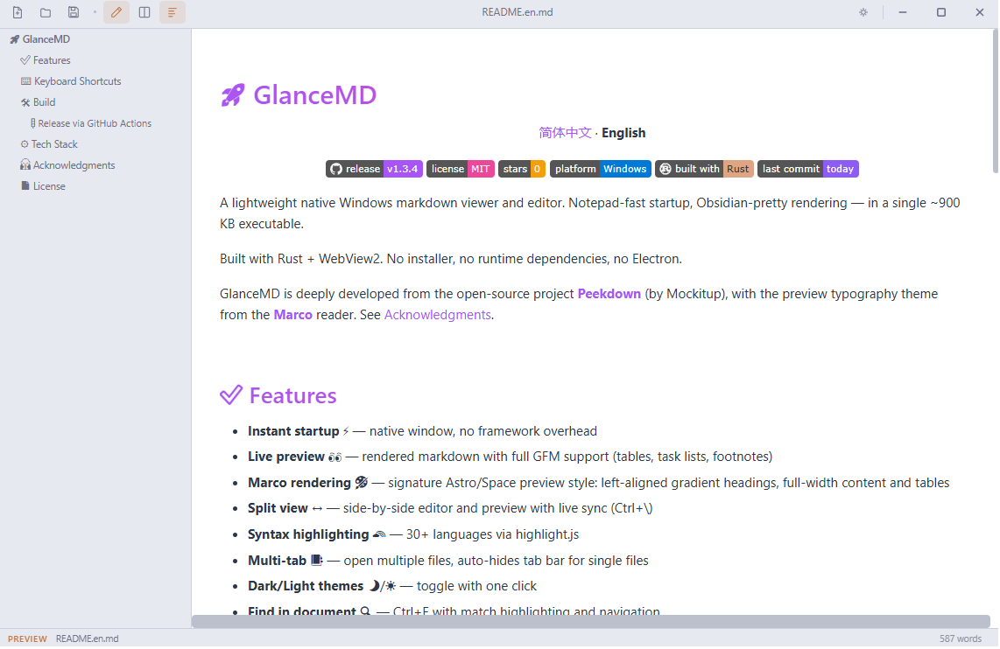
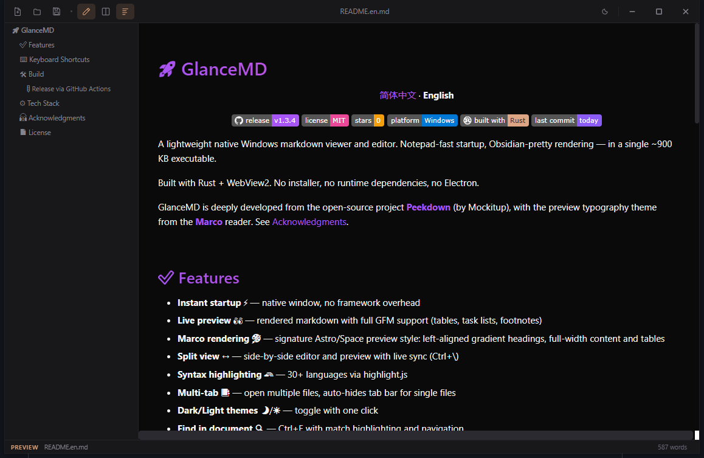

# 🚀 GlanceMD Ultra

<p align="center">
  <a href="README.md">简体中文</a> · <b>English</b>
</p>

<p align="center">
  <a href="https://github.com/VastNext/GlanceMD-Ultra/releases/latest"></a>
  <a href="LICENSE"></a>
  <a href="https://github.com/VastNext/GlanceMD-Ultra/stargazers"></a>
  
  
  
</p>

A **lightweight native workspace editor** for local Markdown and structured-text projects: project tree, file watching with conflict protection, full-text search, and a settings & keyboard-shortcut system. It evolves independently from the [GlanceMD](https://github.com/VastNext/GlanceMD) v1.6.3 snapshot while staying natively light — a 2–5 MB binary with no Electron/Monaco and no external runtime dependencies.

Built with Rust and the system webview, with no Electron. Windows uses WebView2, macOS uses WebKit, and Linux uses WebKitGTK. Notepad-fast startup, Obsidian-pretty rendering.

Project lineage: **[Peekdown](https://github.com/Mockitup/Peekdown)** (by Mockitup) → **GlanceMD** → **GlanceMD Ultra**, with the preview typography theme from the **[Marco](https://github.com/Ranrar/Marco)** reader. See [Acknowledgments](#-acknowledgments).

<p align="center">
  
</p>

<p align="center">
  
</p>

## 🧭 Workspace Capabilities (delivered incrementally)

- **Project tree** 🌲 — lazy-loaded directory tree, multi-select, reveal current file, Ctrl+P quick open
- **File watching & conflict protection** 🛡️ — external change detection, atomic saves, crash recovery
- **Full-text search** 🔍 — project-wide search and filtering
- **Settings & shortcuts** ⚙️ — configurable preferences, keybindings, and a command palette

## ✅ Features (single-file editor baseline)

- **Instant startup** ⚡ — native window, no framework overhead
- **Live preview** 👀 — rendered markdown with full GFM support (tables, task lists, footnotes)
- **Marco rendering** 🎨 — left-aligned gradient headings, full-width content and tables
- **Split view** ↔️ — side-by-side editor and preview with live sync (Ctrl+\\)
- **Syntax highlighting** 🌈 — 30+ languages via highlight.js
- **Multi-tab** 📑 — open multiple files, auto-hides tab bar for single files
- **Dark/Light themes** 🌙/☀️ — toggle with one click
- **Find in document** 🔍 — Ctrl+F with match highlighting and navigation
- **Table of Contents** 🧭 — auto-generated outline sidebar (Ctrl+Shift+O)
- **Zoom** 🔎 — Ctrl+/- or Ctrl+scroll, with level indicator
- **Drag & drop** 📥 — drop `.md` files to open, drop multiple to open tabs
- **Adjustable preview width** 📐 — drag the edge to resize
- **Recent files** 🕘 — quick-open panel on empty tabs
- **Cross-mode selection** 🔄 — selected text stays selected when toggling edit/preview
- **File associations** 📄 — use as default `.md` viewer via "Open With"
- **Embedded frontend** 💾 — HTML, CSS and JavaScript are compiled into the native binary

## ⌨️ Keyboard Shortcuts

| Shortcut | Action |
|---|---|
| Ctrl+O | Open file |
| Ctrl+S | Save |
| Ctrl+Shift+S | Save As |
| Ctrl+N | New tab |
| Ctrl+W | Close tab |
| Ctrl+Tab | Next tab |
| Ctrl+Shift+Tab | Previous tab |
| Ctrl+E | Toggle edit/preview |
| Ctrl+\\ | Toggle split view |
| Ctrl+F | Find in document |
| Ctrl+Shift+O | Toggle outline |
| Ctrl+= / Ctrl+- | Zoom in/out |
| Ctrl+0 | Reset zoom |

## 🛠️ Build

Requires Rust and the target platform's webview development environment. Windows 10/11 includes WebView2; Linux builds also require GTK3 and WebKitGTK 4.1 development packages.

```bash
cargo build --release
```

Windows output: `target/release/GlanceMD-Ultra.exe`. GitHub Actions creates native macOS and Linux packages on their respective runners.

### 🚦 Release via GitHub Actions

Push a `v*` tag to automatically build and publish a release:

```bash
git tag v0.1.0 && git push origin v0.1.0
```

Release artifacts include the Windows x64 EXE (`GlanceMD-Ultra-windows-x64.exe`), unsigned Apple Silicon and Intel macOS DMGs, and Linux x64 DEB/AppImage packages.

> macOS packages are not yet signed with Developer ID or notarized by Apple. The first launch may require manual approval in System Settings → Privacy & Security.

## ⚙️ Tech Stack

- **Rust** — window management, file I/O, IPC ([tao](https://github.com/niceshell/niceshell) + [wry](https://github.com/niceshell/niceshell))
- **System webview** — WebView2 on Windows, WebKit on macOS, WebKitGTK on Linux
- **marked.js** — markdown to HTML
- **highlight.js** — code syntax highlighting
- **No Electron, no Node, no bundler** — all frontend assets are embedded at compile time via `include_str!`

## 🙏 Acknowledgments

This project is built on top of, and deeply indebted to:

- **[Peekdown](https://github.com/Mockitup/Peekdown)** (by Mockitup) — the origin of the project lineage. Window management, file I/O, multi-tab architecture and the overall product shape all come from it
- **[GlanceMD](https://github.com/VastNext/GlanceMD)** (the lightweight single-file edition) — this project evolves independently from its v1.6.3 snapshot; the two repos grow separately and share kernel fixes both ways
- **[Marco](https://github.com/Ranrar/Marco)** / [marco-core](https://github.com/Ranrar/marco-core) (by Kim Skov Rasmussen, MIT) — the preview typography theme is derived from Marco's Astro/Space theme: gradient headings, full-width layout, striped tables and more

Thank you all for open-sourcing your work! 🚀

## 📄 License

MIT — see [LICENSE](LICENSE)
