<div align="center">

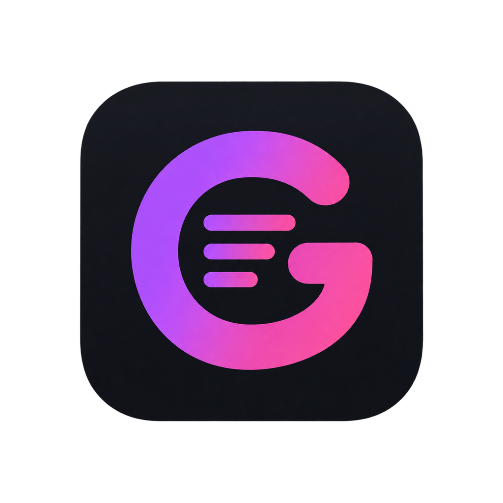

# ✨ GlanceMD Ultra

**A lightweight, native Markdown workspace editor — as fast as Notepad, as pretty as Obsidian.**

**English** · [简体中文](README.zh-CN.md)

<a href="https://github.com/VastNext/GlanceMD-Ultra/releases/latest"></a>
<a href="https://github.com/VastNext/GlanceMD-Ultra/releases/latest"></a>
<a href="LICENSE"></a>
<a href="https://github.com/VastNext/GlanceMD-Ultra/stargazers"></a>


<a href="https://vastnext.com/glance-md-ultra/"></a>

</div>

---

GlanceMD Ultra is a **lightweight, native workspace editor** for local Markdown & structured-text projects: a project tree with full file operations, file watching with conflict protection, project-wide search, a settings & keybinding system — plus **built-in translation (LexiLayer)** for reading and writing across languages.

Built with **Rust + the system WebView** — no Electron, no Node, no bundler. Everything is embedded at compile time into a **single 2–8 MB binary** that starts as fast as Notepad.

> 🧬 Lineage: **[Peekdown](https://github.com/Mockitup/Peekdown)** → **[GlanceMD](https://github.com/VastNext/GlanceMD)** → **GlanceMD Ultra**, wearing the beautiful **[Marco](https://github.com/Ranrar/Marco)** reading theme.

<div align="center">
  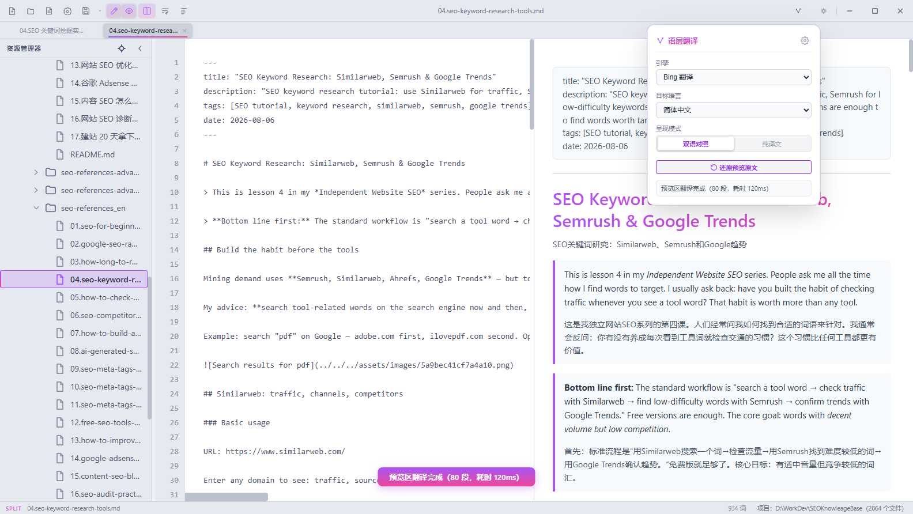
  <p><sub>📖 Bilingual preview — the original article side-by-side with its translation, powered by the built-in LexiLayer engine.</sub></p>
</div>

## ✨ Highlights

- 🌲 **Workspace** — open a local folder as a project: lazy-loading tree, create / rename / move / copy / delete with undo, reveal in file manager, open in terminal
- 🈯 **LexiLayer Translation** — translate the whole preview into **bilingual** or **translation-only** layouts, or translate a selection and write it back in place (`Alt+Shift+X`). Engines: Google, Bing, or any OpenAI-compatible endpoint
- ⌨️ **Keybindings that fit you** — Eclipse & VS Code schemes out of the box, full rebind UI with conflict detection, and a **Key Assist** overlay (`Ctrl+Shift+L`)
- 🧭 **Outline everywhere** — a side outline panel plus a quick-outline fuzzy jump over all headings (`Ctrl+O`)
- 📑 **Real editor ergonomics** — multi-tabs, split view, in-document find, drag & drop, image lightbox, zoom with indicator, cross-mode selection keeping
- 🔍 **Project search** — full-text search across the workspace in a dedicated panel
- 🌍 **Bilingual UI** — 简体中文 / English, one-click switch
- 🌙 **Dark & light themes** — one-key toggle with Marco-inspired gradient typography (`#a855f7 → #ec4899`)
- ⚙️ **Settings done right** — categorized settings with search, global config plus per-project overrides, raw JSON escape hatch
- 🛡️ **File watching & recovery** — external-change protection, atomic saves, crash-recovery snapshots
- 🧪 **Optional Vim mode** — modal editing with a command line, when you want it
- 💾 **Zero dependencies** — single executable, everything embedded; `gmdu .` CLI opens folders like `code .`

## 📸 Screenshots

<table>
  <tr>
    <td width="50%">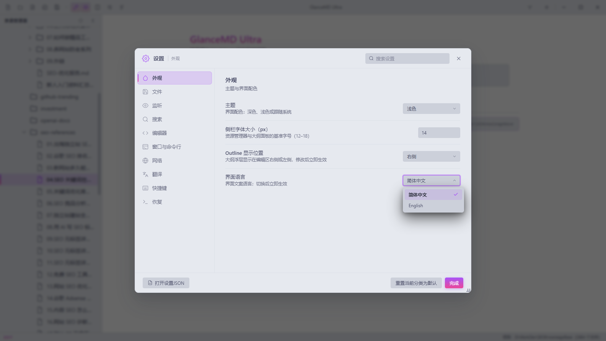</td>
    <td width="50%">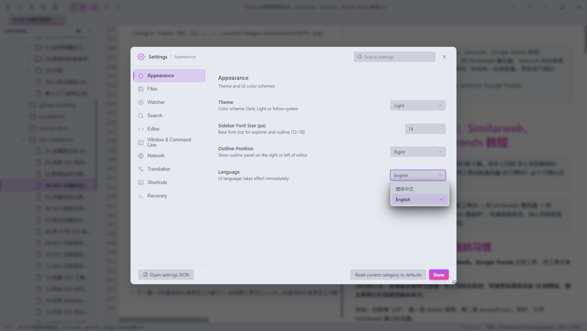</td>
  </tr>
  <tr>
    <td align="center">🌍 界面语言 · 简体中文 / English</td>
    <td align="center">🌍 UI language switcher</td>
  </tr>
  <tr>
    <td>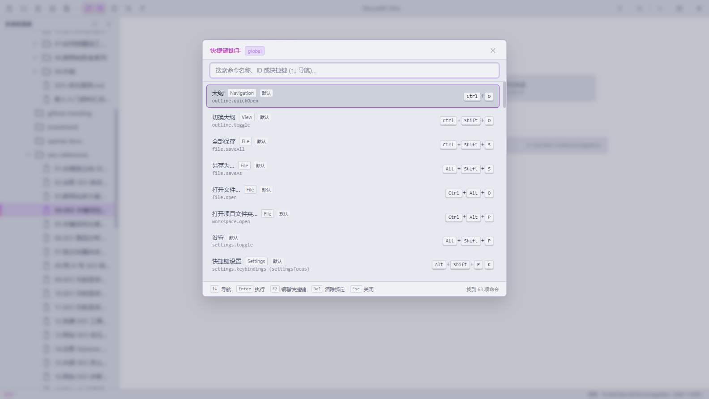</td>
    <td>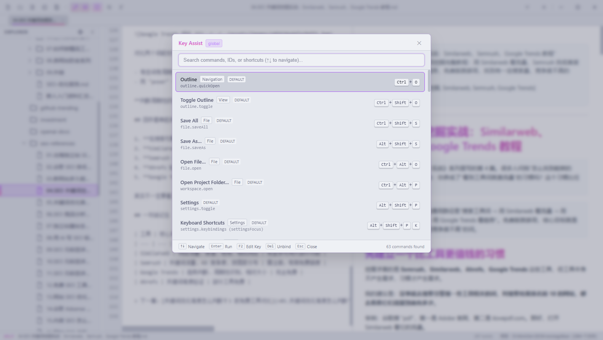</td>
  </tr>
  <tr>
    <td align="center">⌨️ 快捷键助手 · <code>Ctrl+Shift+L</code></td>
    <td align="center">⌨️ Key Assist overlay — every command, searchable</td>
  </tr>
  <tr>
    <td>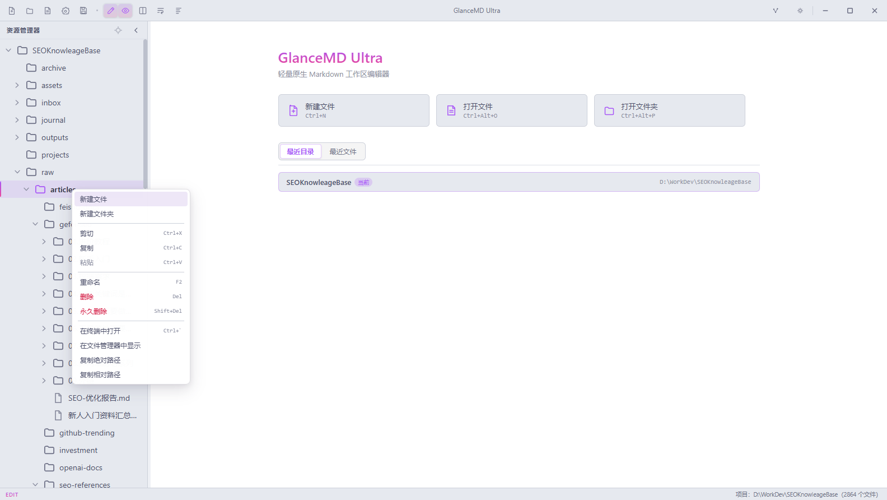</td>
    <td>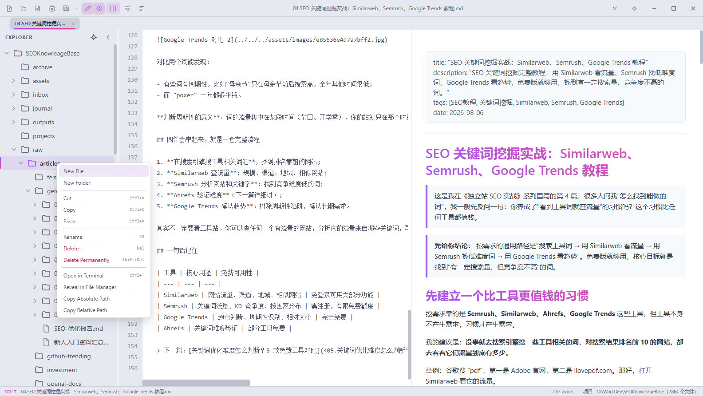</td>
  </tr>
  <tr>
    <td align="center">📁 项目树右键菜单 · 完整文件操作</td>
    <td align="center">📁 Project tree context menu — full file ops</td>
  </tr>
  <tr>
    <td>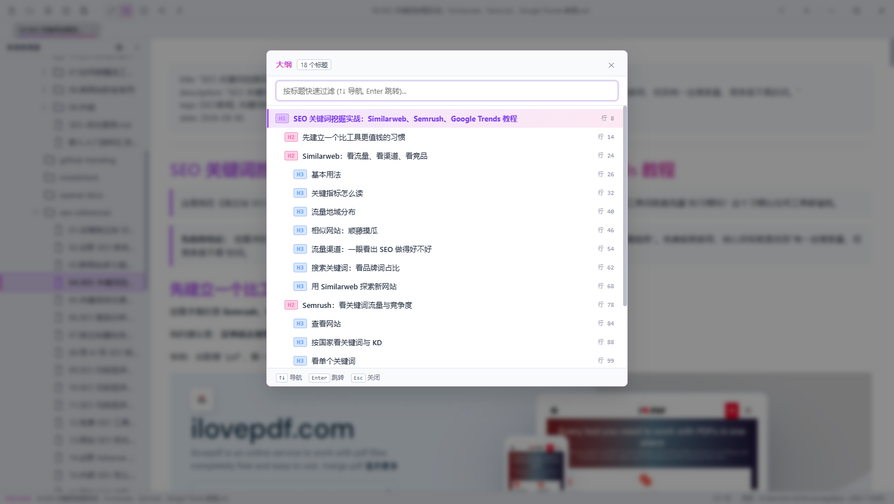</td>
    <td>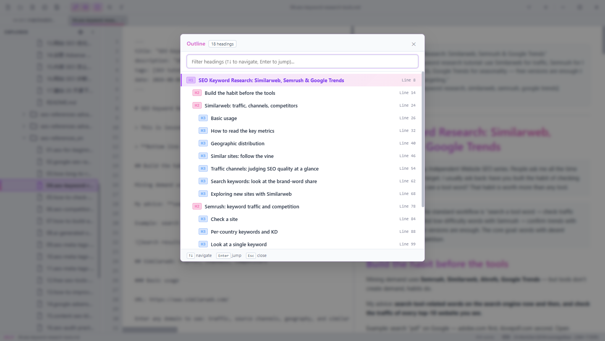</td>
  </tr>
  <tr>
    <td align="center">🧭 快速大纲跳转 · <code>Ctrl+O</code></td>
    <td align="center">🧭 Quick outline fuzzy jump over every heading</td>
  </tr>
  <tr>
    <td>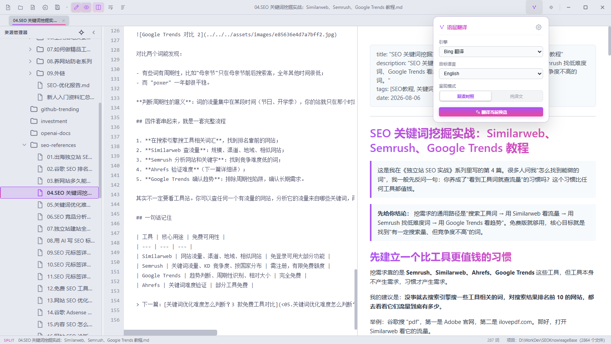</td>
    <td>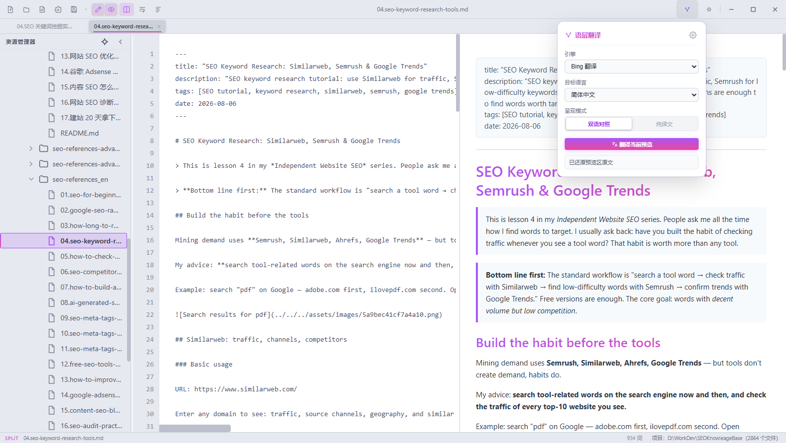</td>
  </tr>
  <tr>
    <td align="center">🈯 语层翻译浮窗 · 引擎 / 目标语言 / 呈现模式</td>
    <td align="center">🈯 LexiLayer popup — engine · target language · layout</td>
  </tr>
  <tr>
    <td>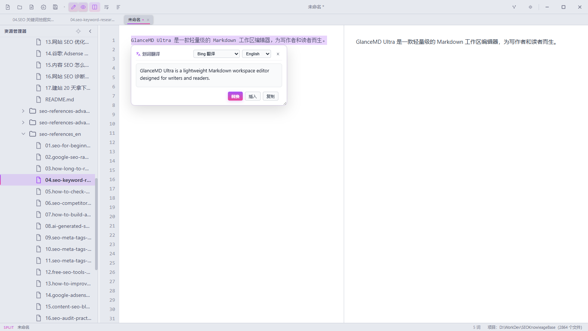</td>
    <td>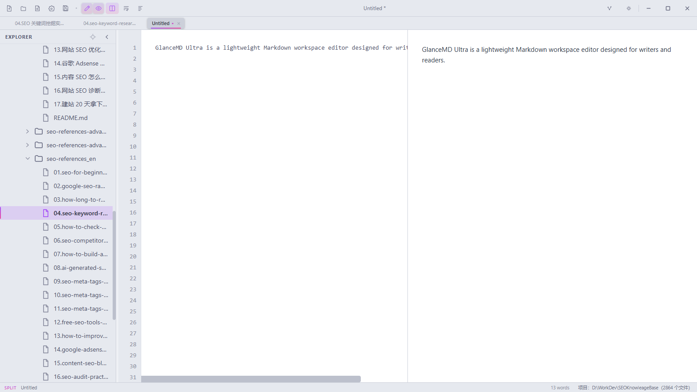</td>
  </tr>
  <tr>
    <td align="center">✍️ 划词翻译气泡 · 替换 / 插入 / 复制</td>
    <td align="center">✍️ Selection translated & written back in place</td>
  </tr>
</table>

## 📥 Download

Grab the latest build from [**Releases**](https://github.com/VastNext/GlanceMD-Ultra/releases/latest) 🚀

| Platform | Artifact |
|---|---|
| 🪟 Windows x64 | `GlanceMD-Ultra-windows-x64.exe` |
| 🍎 macOS (Apple Silicon) | `GlanceMD-Ultra-macos-arm64-unsigned.dmg` |
| 🍎 macOS (Intel) | `GlanceMD-Ultra-macos-x64-unsigned.dmg` |
| 🐧 Linux (deb) | `GlanceMD-Ultra_<version>_amd64.deb` |
| 🐧 Linux (AppImage) | `GlanceMD-Ultra_<version>_x86_64.AppImage` |

> ⚠️ macOS builds are not signed/notarized yet — right-click → **Open** on first launch, or allow it in *System Settings → Privacy & Security*.

## ⌨️ Key bindings at a glance

| Keys | Action |
|---|---|
| `Ctrl+N` / `Ctrl+S` / `Ctrl+W` | New tab · Save · Close tab |
| `Ctrl+O` | 🔍 Quick outline fuzzy jump |
| `Ctrl+Alt+O` / `Ctrl+Alt+P` | Open file · Open folder as workspace |
| `Ctrl+Shift+L` | **Key Assist** — search every command & shortcut |
| `Alt+T` | Translate selection (LexiLayer bubble) |
| `Alt+Shift+X` | Translate selection & replace it in place |
| `Alt+A` / `Alt+B` / `Alt+V` | Toggle preview translation · Bilingual · Translation-only |
| `Ctrl+Shift+O` | Toggle outline panel |
| `Ctrl+\` / `Ctrl+Shift+V` | Split view · Toggle edit / preview |
| `Ctrl+=` / `Ctrl+-` / `Ctrl+0` | Zoom in · out · reset |

Everything is rebindable — **Eclipse** and **VS Code** schemes included, with conflict detection and a full editor under *Settings → Shortcuts*.

## 🛠️ Build from source

Requires Rust and your platform's WebView runtime (Windows 10/11 ships WebView2; Linux needs GTK3 & WebKitGTK 4.1 dev packages).

```bash
cargo build --release
```

Windows artifact: `target/release/GlanceMD-Ultra.exe`. macOS & Linux release artifacts are built by GitHub Actions on native runners.

### 🚦 Release automation

Pushing a `v*` tag builds and publishes a Release automatically:

```bash
git tag v0.6.1 && git push origin v0.6.1
```

## ⌨️ The `gmdu` CLI

Open a workspace from the terminal, just like `code .`:

```bash
gmdu .
```

Install it from *Settings → Window & Command Line*, or run the executable once with `--install-cli`. Also available: `--uninstall-cli`, `--cli-status`, `--version`.

## ⚙️ Tech stack

- **Rust** — windowing, file I/O, IPC ([tao](https://github.com/niceshell/niceshell) + [wry](https://github.com/niceshell/niceshell))
- **System WebView** — WebView2 on Windows, WebKit on macOS, WebKitGTK on Linux
- **marked.js + highlight.js** — Markdown rendering & syntax highlighting
- **No Electron, no Node, no bundler** — all frontend assets embedded via `include_str!`

## 🙏 Acknowledgments

Standing on the shoulders of:

- **[Peekdown](https://github.com/Mockitup/Peekdown)** (by Mockitup) — where it all began: windowing, file I/O, multi-tab architecture
- **[GlanceMD](https://github.com/VastNext/GlanceMD)** — the single-file edition this project evolved from
- **[Marco](https://github.com/Ranrar/Marco)** / marco-core (by Kim Skov Rasmussen, MIT) — the gorgeous reading typography

## 📄 License

[MIT](LICENSE) © VastNext — free forever, built with 💜.
