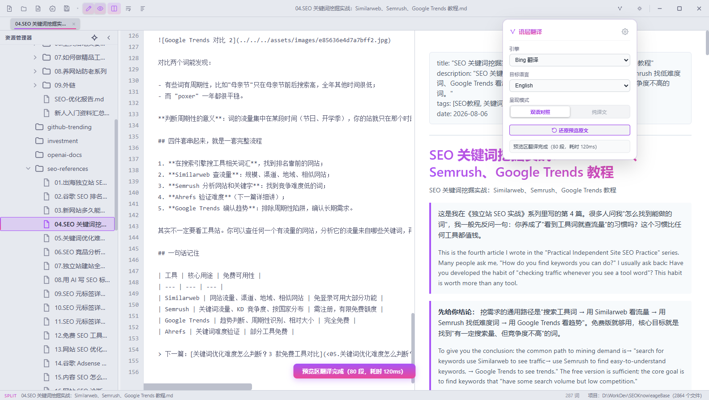
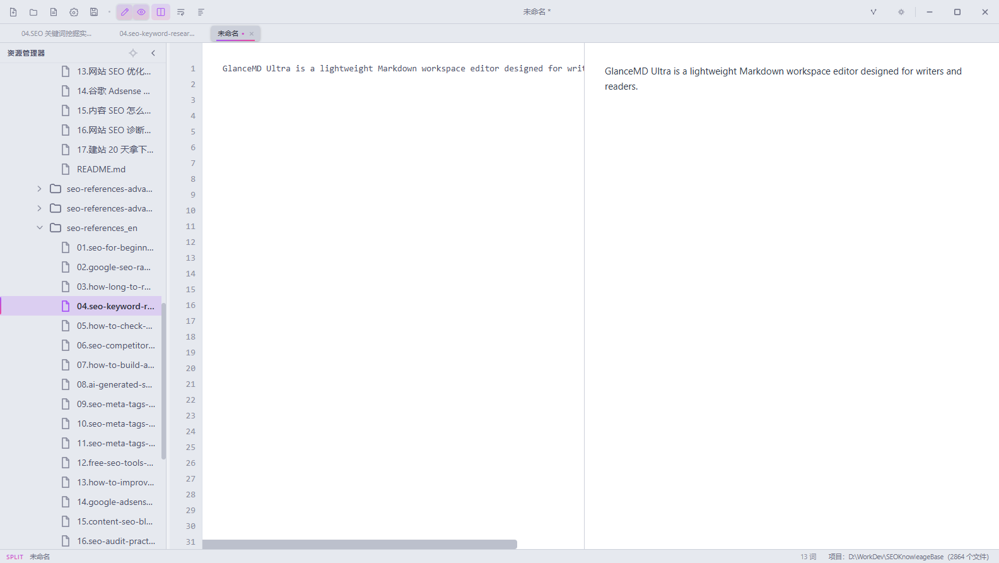

<div align="center">


# ✨ GlanceMD Ultra

**轻量原生 Markdown 工作区编辑器 —— 启动媲美记事本，排版媲美 Obsidian。**

[English](README.md) · **简体中文**

<a href="https://github.com/VastNext/GlanceMD-Ultra/releases/latest"></a>
<a href="https://github.com/VastNext/GlanceMD-Ultra/releases/latest"></a>
<a href="LICENSE"></a>
<a href="https://github.com/VastNext/GlanceMD-Ultra/stargazers"></a>


<a href="https://vastnext.com/glance-md-ultra/"></a>

</div>

---

GlanceMD Ultra 是面向本地 Markdown 与结构化文本项目的**轻量原生工作区编辑器**：项目树与完整文件操作、文件监听与冲突保护、项目级全文搜索、设置与快捷键体系——再配上 **内置翻译引擎（语层翻译）**，让你在跨语言读写间自由切换。

基于 **Rust + 系统 WebView** 构建——不含 Electron、不含 Node、不含打包器，所有资源在编译期嵌入，最终就是一个 **2–8 MB 的单一可执行文件**，启动速度媲美记事本。

> 🧬 血脉：**[Peekdown](https://github.com/Mockitup/Peekdown)** → **[GlanceMD](https://github.com/VastNext/GlanceMD)** → **GlanceMD Ultra**，穿着 **[Marco](https://github.com/Ranrar/Marco)** 阅读器的漂亮排版。

<div align="center">
  
  <p><sub>📖 双语对照预览——原文与译文并排呈现，由内置语层翻译引擎驱动。</sub></p>
</div>

## ✨ 功能亮点

- 🌲 **工作区** — 将本地文件夹打开为项目：懒加载项目树、新建/重命名/移动/复制/删除（可撤销）、在文件管理器中显示、在终端中打开
- 🈯 **语层翻译** — 预览区全文一键 **双语对照 / 纯译文** 呈现；划词翻译并可原位写回（`Alt+Shift+X`）。引擎：Google、Bing 或任意 OpenAI 兼容接口
- ⌨️ **懂你的快捷键** — 内置 Eclipse 与 VS Code 两套方案，完整改键 UI 与冲突检测，`Ctrl+Shift+L` 唤起 **快捷键助手**
- 🧭 **大纲无处不在** — 侧栏 Outline 面板 + 全标题模糊跳转的快速大纲（`Ctrl+O`）
- 📑 **真正的编辑器手感** — 多标签、分屏视图、文档内查找、拖放打开、图片灯箱、缩放指示、跨模式选区保持
- 🔍 **项目搜索** — 工作区级全文搜索面板
- 🌍 **双语界面** — 简体中文 / English，一键切换
- 🌙 **深色 / 浅色主题** — 一键切换，Marco 风格渐变排版（`#a855f7 → #ec4899`）
- ⚙️ **设置体系** — 分类设置与搜索、全局配置 + 项目级覆盖、设置 JSON 直改入口
- 🛡️ **文件监听与恢复** — 外部变更保护、原子保存、崩溃恢复快照
- 🧪 **可选 Vim 模式** — 想要时开启的模态编辑与命令行
- 💾 **零依赖** — 单一可执行文件，资源全内嵌；`gmdu .` 命令行像 `code .` 一样打开目录

## 📸 界面速览

<table>
  <tr>
    <td width="50%"></td>
    <td width="50%"></td>
  </tr>
  <tr>
    <td align="center">🌍 界面语言 · 简体中文 / English</td>
    <td align="center">🌍 一键切换界面语言</td>
  </tr>
  <tr>
    <td></td>
    <td></td>
  </tr>
  <tr>
    <td align="center">⌨️ 快捷键助手 · <code>Ctrl+Shift+L</code></td>
    <td align="center">⌨️ 全部命令可搜索、可执行</td>
  </tr>
  <tr>
    <td></td>
    <td></td>
  </tr>
  <tr>
    <td align="center">📁 项目树右键菜单 · 完整文件操作</td>
    <td align="center">📁 打开文件夹即为工作区</td>
  </tr>
  <tr>
    <td></td>
    <td></td>
  </tr>
  <tr>
    <td align="center">🧭 快速大纲跳转 · <code>Ctrl+O</code></td>
    <td align="center">🧭 标题层级 + 行号，回车即达</td>
  </tr>
  <tr>
    <td></td>
    <td></td>
  </tr>
  <tr>
    <td align="center">🈯 语层翻译浮窗 · 引擎 / 目标语言 / 呈现模式</td>
    <td align="center">🈯 中文文档一键译成英文</td>
  </tr>
  <tr>
    <td></td>
    <td></td>
  </tr>
  <tr>
    <td align="center">✍️ 划词翻译气泡 · 替换 / 插入 / 复制</td>
    <td align="center">✍️ 替换后英文写回编辑器，预览实时同步</td>
  </tr>
</table>

## 📥 下载

前往 [**Releases**](https://github.com/VastNext/GlanceMD-Ultra/releases/latest) 获取最新版本 🚀

| 平台 | 产物 |
|---|---|
| 🪟 Windows x64 | `GlanceMD-Ultra-windows-x64.exe` |
| 🍎 macOS（Apple Silicon） | `GlanceMD-Ultra-macos-arm64-unsigned.dmg` |
| 🍎 macOS（Intel） | `GlanceMD-Ultra-macos-x64-unsigned.dmg` |
| 🐧 Linux（deb） | `GlanceMD-Ultra_<version>_amd64.deb` |
| 🐧 Linux（AppImage） | `GlanceMD-Ultra_<version>_x86_64.AppImage` |

> ⚠️ macOS 产物尚未签名/公证：首次运行请右键 → **打开**，或在「系统设置 → 隐私与安全性」中手动放行。

## ⌨️ 常用快捷键

| 按键 | 功能 |
|---|---|
| `Ctrl+N` / `Ctrl+S` / `Ctrl+W` | 新建标签 · 保存 · 关闭标签 |
| `Ctrl+O` | 🔍 快速大纲模糊跳转 |
| `Ctrl+Alt+O` / `Ctrl+Alt+P` | 打开文件 · 打开文件夹为工作区 |
| `Ctrl+Shift+L` | **快捷键助手** — 搜索所有命令与快捷键 |
| `Alt+T` | 划词翻译（语层翻译气泡） |
| `Alt+Shift+X` | 划词翻译并原位替换 |
| `Alt+A` / `Alt+B` / `Alt+V` | 预览翻译切换 · 双语对照 · 纯译文 |
| `Ctrl+Shift+O` | 切换 Outline 面板 |
| `Ctrl+\` / `Ctrl+Shift+V` | 分屏视图 · 切换编辑/预览 |
| `Ctrl+=` / `Ctrl+-` / `Ctrl+0` | 放大 · 缩小 · 重置 |

所有快捷键均可改键——内置 **Eclipse** 与 **VS Code** 两套方案，带冲突检测，完整编辑入口在「设置 → 快捷键」。

## 🛠️ 从源码构建

需要 Rust 与对应平台的 WebView 运行时（Windows 10/11 自带 WebView2；Linux 需要 GTK3 与 WebKitGTK 4.1 开发包）。

```bash
cargo build --release
```

Windows 产物：`target/release/GlanceMD-Ultra.exe`。macOS 与 Linux 的正式产物由 GitHub Actions 在原生 Runner 上构建。

### 🚦 发布自动化

推送 `v*` 标签即自动构建并发布 Release：

```bash
git tag v0.6.1 && git push origin v0.6.1
```

## ⌨️ `gmdu` 命令行

在终端中像 `code .` 一样打开工作区：

```bash
gmdu .
```

安装方式：设置 → 窗口与命令行 → 安装 gmdu 命令；或执行一次 `GlanceMD-Ultra --install-cli`。另有 `--uninstall-cli`、`--cli-status`、`--version`。

## ⚙️ 技术栈

- **Rust** — 窗口管理、文件读写、进程通信（[tao](https://github.com/niceshell/niceshell) + [wry](https://github.com/niceshell/niceshell)）
- **系统 WebView** — Windows 使用 WebView2，macOS 使用 WebKit，Linux 使用 WebKitGTK
- **marked.js + highlight.js** — Markdown 渲染与语法高亮
- **不含 Electron、不含 Node、不含打包器** — 全部前端资源通过 `include_str!` 在编译期嵌入

## 🙏 致谢

站在巨人的肩膀上：

- **[Peekdown](https://github.com/Mockitup/Peekdown)**（by Mockitup）— 一切的起点：窗口管理、文件 I/O、多标签架构
- **[GlanceMD](https://github.com/VastNext/GlanceMD)** — 本项目由其单文件轻量版独立演进而来
- **[Marco](https://github.com/Ranrar/Marco)** / marco-core（by Kim Skov Rasmussen，MIT）— 优雅的阅读排版主题

## 📄 许可证

[MIT](LICENSE) © VastNext — 永久免费，用 💜 打造。
