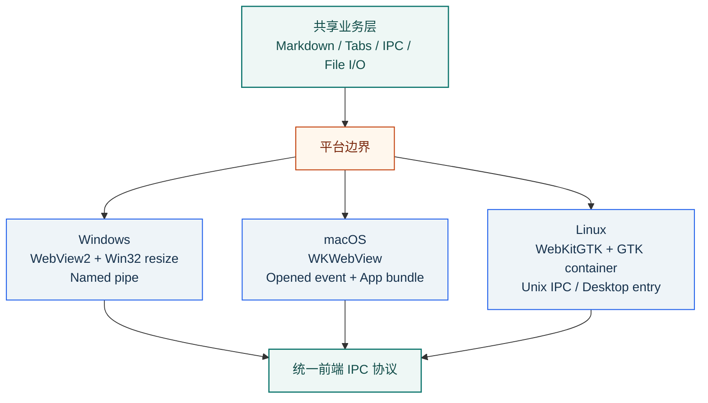
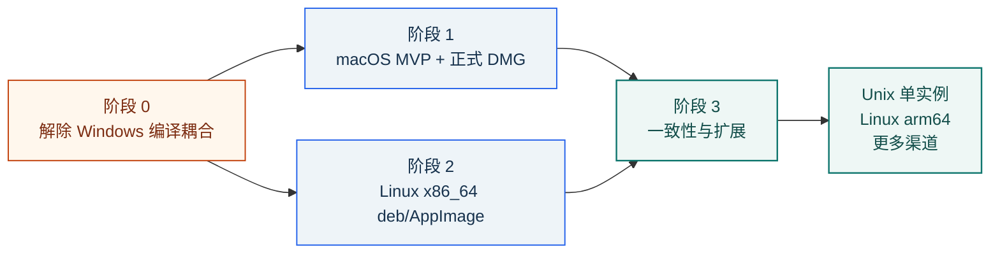

# GlanceMD macOS / Linux 打包与适配可行性研究

> 研究日期：2026-08-26
>
> 结论适用范围：当前项目版本（Cargo.toml 1.3.6，Wry 0.49、Tao 0.33、Rfd 0.15）

## 执行摘要

**可以打包成 macOS 和 Linux 软件，而且不需要迁移 Electron，也不需要重写现有前端。** 当前技术栈本来就具备跨平台能力：Wry 在 macOS 使用系统 WebKit，在 Linux 使用 WebKitGTK；Tao 和 Rfd 也支持这两个平台。Markdown 解析、编辑器、多标签、主题、查找、目录等大部分代码可以原样复用。

但这不是“给 `cargo build` 换两个 target”就能完成。当前工程把 Windows 专属依赖和实现直接放在公共路径中，包括 WebView2/Win32 API、Windows 资源脚本、named mutex/named pipe 单实例、自定义协议 URL，以及只识别 Ctrl 的快捷键。它们需要先被条件编译隔离或替换。

推荐落地顺序是：

1. 先完成共用的跨平台编译骨架，确保 Windows 不回退；
2. 先发布 macOS，因为系统 WebKit 和平台组合更收敛；
3. 再发布 Linux x86_64，并明确验证 X11/Wayland 与 WebKitGTK 依赖；
4. 最后补三平台一致的单实例、Linux arm64 和更多分发渠道。

下面这张表是决策的最短版本：

| 项目 | Windows（现状） | macOS（建议） | Linux（建议） |
|---|---|---|---|
| WebView | WebView2 | 系统 WKWebView/WebKit | WebKitGTK 4.1 + GTK3 |
| Rust target | `x86_64-pc-windows-msvc` | `aarch64-apple-darwin` + `x86_64-apple-darwin` | 首发 `x86_64-unknown-linux-gnu` |
| 正式产物 | `GlanceMD.exe` | Universal 2 `GlanceMD.app` + `.dmg` | `.deb` + `.AppImage` |
| 图标 | `.ico` | `.icns` | PNG/SVG，多尺寸 hicolor |
| 文件关联 | CLI/打开方式 | `Info.plist` + `Event::Opened` | `.desktop` + MIME + `Exec=%F` |
| 正式发布信任 | 可继续现状 | Developer ID 签名 + Hardened Runtime + 公证 | 可选 GPG/仓库签名；重点是依赖与兼容测试 |
| 运行时依赖 | 系统 WebView2 | 系统 WebKit | 系统/随包提供的 GTK、WebKitGTK 等动态库 |
| 最大难点 | 已解决 | Finder 文件事件、签名公证、双架构 | X11/Wayland、动态依赖、发行版兼容 |

## 一、当前有哪些硬阻塞

### 1. Cargo 依赖是全局的

当前 `Cargo.toml` 把 `webview2-com`、`windows` 和 `winresource` 放在所有目标都会解析的依赖区。应改成目标专属依赖：

- Windows dependencies：`webview2-com`、`windows`；
- Windows build-dependencies：`winresource`；
- Linux 若需要直接调用 GTK container API，再加入 Linux target 的 GTK 依赖，并与 Tao/Wry 锁定的 GTK3 版本一致。

Cargo 官方支持 `[target.'cfg(windows)'.dependencies]` 这类配置。目标是让平台专属 crate 不进入其他平台的编译路径，而不只是靠“代码没调用它”。

### 2. `build.rs` 无条件编译 Windows 资源

现有脚本每次都会调用 `winresource` 编译 `.ico`。非 Windows 目标应直接跳过。这里要读取 `CARGO_CFG_TARGET_OS`，不能只对 build script 写 `#[cfg(windows)]`，因为 build script 自身是为构建宿主编译的，交叉编译时会判断错对象。

### 3. `main.rs` 直接依赖 Win32/WebView2

当前公共入口包含：

- `windows_subsystem = "windows"`；
- Win32 `HWND`、`RECT`、`SetWindowPos`；
- `WebViewBuilderExtWindows`、`WebViewExtWindows`；
- WebView2 controller resize 修复；
- `GetStdHandle`/`GetFileType` 判断 stdin 是否为管道。

这些应收敛为少数平台函数，例如：

- `platform::configure_webview(builder)`；
- `platform::build_webview(builder, window)`；
- `platform::resize_webview(...)`；
- `platform::stdin_is_piped()`；
- `platform::initial_url()`。

`windows_subsystem` 则改为 `cfg_attr`，只在 Windows 目标生效。

### 4. 单实例完全是 Windows 实现

`single_instance.rs` 使用 kernel32 named mutex 检测实例，用 named pipe 转发文件。它会在 macOS/Linux 直接编译失败。

有两种合理范围：

- **MVP：** 非 Windows 暂时允许多实例，先把核心查看/编辑功能发布出去；
- **完整一致：** 抽象统一接口，macOS/Linux 使用锁文件或 Unix domain socket，并实现文件路径转发。

第二种方案要接受一个平台事实：Wayland 通常不允许应用无条件抢焦点，所以“第二实例把主窗口强制拉到最前”无法保证与 Windows 完全一致。可以恢复窗口并请求注意，但最终由 compositor 决定。

### 5. 自定义协议 URL 不能写死

当前注册协议名为 `glancemd`，初始页面写成：

```text
http://glancemd.localhost/
```

这是 Wry 在 Windows/WebView2 上为自定义协议做的映射。Wry 官方文档明确说明：

- Windows：默认 origin 形如 `http://glancemd.localhost/`；
- macOS/Linux：形如 `glancemd://localhost/`。

协议 handler 和本地图片 query 逻辑可以继续复用，但初始 URL 必须按平台选择，并对三平台根路径与图片加载做回归测试。

### 6. 前端快捷键只认 Ctrl

macOS 用户预期 Command：`⌘O`、`⌘S`、`⌘W`、`⌘F` 等。当前所有快捷键只判断 `e.ctrlKey`，会导致应用能启动却像一个不合格的 Mac 移植版。

建议抽出主修饰键：

```js
var primaryModifier = e.ctrlKey || e.metaKey;
```

同时根据平台更新按钮 tooltip。触控板缩放、IME 和组合键仍需实机验证，不能只依赖浏览器单元测试。

## 二、共用架构应如何调整

下图展示的是最小平台边界。业务层不需要被拆成三份，只有窗口/WebView、进程通信和桌面入口进入平台模块。



读者应带走的判断是：这是一次局部的平台化，不是架构重写。平台层越薄，后续三平台功能迭代越不容易分叉。

建议保持当前 Wry 0.49/Tao 0.33 组合完成第一轮移植，不要同时引入 GTK4/WebKit 6 迁移。先减少变量，依赖大升级另行评估。

## 三、macOS 需要哪些适配

### 运行适配

- 使用普通 `WebViewBuilder::build(&window)`，不导入 Windows extension traits；
- 初始 URL 改为 `glancemd://localhost/`；
- 删除 WebView2 controller resize 路径，依赖 Wry/Tao 的 macOS 布局；
- stdin 是否来自终端可用标准库 `IsTerminal` 或 Unix 实现；
- release 默认关闭 devtools。Wry 提醒 macOS release devtools 可能涉及私有 API，尤其不适合 App Store；GitHub 直发也没有必要默认开放。

### Finder 和文件关联

macOS 不是简单把双击文件都作为 `argv` 传入。应用要：

1. 在 `Info.plist` 声明 `.md/.markdown/.txt` 文档类型；
2. 在 Tao 事件循环处理 `Event::Opened { urls }`；
3. 把 `file:` URL 安全转换为本地路径；
4. 若事件早于 WebView ready，则先缓存，待前端发送 `ready` 后打开；
5. 同时处理应用已运行时再次从 Finder 打开文件。

这一步不能省略，否则用户会看到 GlanceMD 被唤起，但文档没有打开。

### 窗口外观

当前窗口关闭了系统 decorations，并在网页右侧画了 Windows 风格最小化/最大化/关闭按钮。macOS 首版建议启用原生窗口装饰和红黄绿 traffic lights；若一定要保留统一自绘界面，需要额外处理安全区、拖动区、双击标题栏行为和全屏，工作量与风险都会增加。

### 应用包与图标

macOS 正式产物不是裸 binary，而是 `.app` bundle，通常装进 `.dmg`：

```text
GlanceMD.app/
└── Contents/
    ├── Info.plist
    ├── MacOS/GlanceMD
    └── Resources/GlanceMD.icns
```

现有 `icon.png` 可以生成多尺寸 `.icns`；不能直接复用 `.ico`。`Info.plist` 应设置 bundle identifier（例如 `com.vastnext.glancemd`，最终由维护者确认）、版本、显示名、图标、类别和文档关联。

### 架构、签名与公证

建议同时构建：

- Apple Silicon：`aarch64-apple-darwin`；
- Intel：`x86_64-apple-darwin`。

可分别发布两份 DMG，也可按 Apple 官方方法用 `lipo` 合并为 Universal 2。对用户最省心的是单份 Universal 2；对 CI 简洁和下载体积更敏感时，可以分架构发布。

正式 GitHub Release 推荐完整信任链：

1. Apple Developer Program 的 `Developer ID Application` 证书；
2. 以 Hardened Runtime 方式 codesign；
3. 使用 `notarytool` 提交 Apple 公证；
4. 公证成功后 `stapler`；
5. 用 `codesign --verify`、`spctl`、`stapler validate` 验证；
6. 在带 quarantine 属性的真实下载场景测试首次启动。

没有 Apple 证书时仍能构建内部预览包，但不应把 Gatekeeper 警告明显的包当正式版本。

## 四、Linux 需要哪些适配

### WebView 与系统依赖

当前锁定依赖使用 GTK3 + WebKitGTK 4.1。Ubuntu/Debian 构建机至少需要：

- `libgtk-3-dev`；
- `libwebkit2gtk-4.1-dev`；
- 编译工具和 `pkg-config`；
- Rfd 默认 XDG Portal 路径所需的 D-Bus/desktop portal 环境，必要时 Zenity fallback。

运行时也必须有对应共享库。`.deb` 可以声明依赖并让 apt 安装；AppImage 可以捆绑一部分库，但 WebKitGTK、glibc 和图形栈仍有兼容边界。因此 Linux 版不应沿用“无运行时依赖、约 900 KB”的 Windows 文案。

### X11 与 Wayland

Wry 文档说明，直接对 raw window 调用 `build(&window)` 的 Linux 支持重点是 X11。若要同时支持 X11 和 Wayland，推荐使用 Tao 提供的 GTK container 与 Wry 的 `build_gtk` 路径。

项目应二选一并写清发布声明：

- **低工作量首版：** 仅保证 X11；
- **推荐正式版：** 一开始使用 GTK container，验证 GNOME Wayland、KDE Wayland 和 X11。

由于现代 Ubuntu 默认使用 Wayland，更推荐后者。API 的精确名称应由 Wry 0.49 在 Linux CI 的编译结果确认。

### 桌面集成与文件关联

Linux 包需要 `.desktop` entry，核心内容类似：

```ini
[Desktop Entry]
Name=GlanceMD
Exec=GlanceMD %F
Icon=glancemd
Type=Application
Categories=Utility;TextEditor;
MimeType=text/markdown;text/plain;
```

`%F` 会把多个本地文件作为多个参数传给应用，适合现有多标签能力。图标应安装到标准 hicolor 目录。应用可以声明支持 Markdown，但不应强行覆盖用户的默认程序；默认关联由桌面环境与 `mimeapps.list` 管理。

### 包格式

首发建议同时提供：

- `.deb`：面向 Ubuntu/Debian，依赖管理和菜单/MIME 集成更可靠；
- `.AppImage`：面向便携和其他发行版尝试使用。

AppImage 应在“最老的支持基线”上构建，并在更高版本系统运行。考虑到当前 WebKitGTK 4.1 的可用性，建议先把 Ubuntu 24.04 作为候选基线，再通过样包验证是否需要调整。若 AppImage 的 WebKitGTK 兼容成本过高，可以优先保证 `.deb`，并在后续采用 Flatpak，而不是承诺一个实际不可靠的“全发行版单文件”。

首发架构建议只做 x86_64；Linux arm64 有官方 Rust target 和 GitHub runner，但桌面依赖与 AppImage 工具覆盖要另做验证。

## 五、打包工具建议

推荐使用 Cargo Packager，而不是为了打包把项目迁移到 Tauri。它与当前纯 Rust 单 binary 项目匹配，并支持：

- macOS `.app`、`.dmg`；
- Linux `.deb`、`.AppImage`、Pacman；
- 图标、类别、资源、文件关联；
- macOS 签名/公证配置。

可以新增 `Packager.toml`，把产品名、identifier、版本、图标、文件关联和各平台格式集中管理。CI 中将流程分成两步：

1. `cargo build --release --target ...`；
2. Cargo Packager 组装、签名和输出 package。

这种分层让“Rust 编译失败”和“包元数据/签名失败”更容易区分。

## 六、CI/CD 与测试矩阵

不推荐在 Windows runner 上交叉生成全部正式包。每个平台在原生 runner 构建，能同时解决 SDK、原生动态库、打包工具和 smoke test。

| Job | Runner / target | 任务 | 发布门禁 |
|---|---|---|---|
| Windows x64 | `windows-latest` / `x86_64-pc-windows-msvc` | 保持现有 release build | EXE 启动与关键回归 |
| macOS arm64 | `macos-latest` / `aarch64-apple-darwin` | build/test | arm64 binary 通过 |
| macOS Intel | `macos-15-intel` / `x86_64-apple-darwin` | build/test | x86_64 binary 通过 |
| macOS package | macOS runner | `lipo`、app/DMG、sign、notarize、staple | Gatekeeper 验证通过 |
| Linux x64 | Ubuntu 所选基线 / `x86_64-unknown-linux-gnu` | 安装 GTK/WebKitGTK，build/package | deb/AppImage 生成、依赖检查 |
| Linux GUI smoke | Xvfb + 实机/VM Wayland | 启动、打开文件、拖放、IME | 支持矩阵全部通过 |

GUI 应至少验证：

- 启动、退出、窗口状态恢复、最小化/最大化；
- 打开、保存、另存为，包含空格和中文路径；
- CLI、Finder/文件管理器双击、运行中打开第二个文件；
- 多文件拖放和单实例降级策略；
- 编辑、预览、分屏、本地图片协议、最近文件；
- Command/Ctrl 快捷键、缩放、触控板/滚轮；
- 中文输入法、深浅主题、高 DPI、多显示器；
- 断网启动和 release 不暴露 devtools。

## 七、推荐实施路线与工作量

下图表示真实依赖关系。macOS 与 Linux 的打包工作都依赖第一阶段的平台化，不应各自复制一份 `main.rs`。



粗略工作量只能按范围分级，不能在没有实机构建和团队速度的情况下伪造天数：

| 工作包 | 量级 | 最大不确定性 |
|---|---|---|
| 解除 Windows 编译耦合 | 小到中 | WebView resize、协议 URL、依赖 target 化 |
| macOS 可运行 MVP | 中 | Finder Opened 时序、窗口装饰 |
| macOS 正式分发 | 中 | Apple 账户、证书、公证 CI |
| Linux X11 MVP | 中 | GTK/WebKitGTK 依赖和包配置 |
| Linux X11 + Wayland 正式支持 | 中到大 | GTK container、桌面环境差异 |
| 三平台单实例完全一致 | 中 | Unix IPC、macOS事件、Wayland聚焦限制 |

## 八、主要风险与回退方案

| 风险 | 影响 | 建议控制 | 回退方案 |
|---|---|---|---|
| macOS 无 Developer ID | 正式包被 Gatekeeper 警告 | 尽早确认 Apple 账户与证书 | 只发布明确标注的 preview，不宣称正式版 |
| Linux 只在 X11 构建 | 默认 Wayland 用户不可用或异常 | 采用 `build_gtk` 并做 GNOME/KDE 测试 | 明确首版仅 X11 |
| AppImage 捆绑 WebKitGTK 不稳定 | 跨发行版启动失败 | 选定最低基线，建立 VM 兼容矩阵 | 先保证 deb，后续改 Flatpak |
| 单实例跨平台过早复杂化 | 延迟核心版本 | 将单实例列为独立工作包 | macOS/Linux MVP 允许多实例 |
| 自绘标题栏复制到 macOS | 窗口体验和全屏行为异常 | macOS 先用系统 decorations | 保留 Windows 自绘，平台差异化 UI |
| 同时升级 GTK/Wry/Tao | 移植变量叠加，难定位问题 | 第一轮保持当前锁定版本 | 升级另立变更，不与跨平台首发绑定 |
| 仅做 CI 编译不做 GUI 实测 | 拖放、IME、Wayland、Gatekeeper 问题漏检 | 每个平台保留真实设备/VM 发布清单 | 将产物标记 preview，未通过不升正式版 |

## 最终建议

这个项目非常适合做跨平台：前端资源已内嵌，核心是标准 Rust 文件 I/O 和 Web 技术，底层库也已经覆盖三大桌面系统。真正要避免的是把“库支持跨平台”误解成“当前应用已经跨平台”。

建议立即采用以下范围作为第一个实现里程碑：

1. 三平台都能通过原生 CI 编译；
2. Windows 现有 EXE 行为无回退；
3. macOS 先完成原生装饰、Command 快捷键、Finder 打开文件和 Universal 2 preview；
4. Apple 凭据就绪后升级为签名公证 DMG；
5. Linux 用 GTK container 直接瞄准 X11 + Wayland，首发 x86_64 deb/AppImage；
6. 单实例完整一致、Linux arm64 和渠道扩展不阻塞 MVP。

在这个范围下，跨平台不是一次推倒重来，而是一轮可控的平台边界重构，加上两条独立的发布工程链路。
