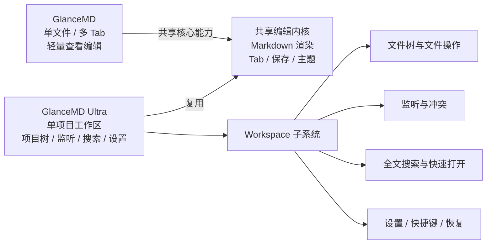
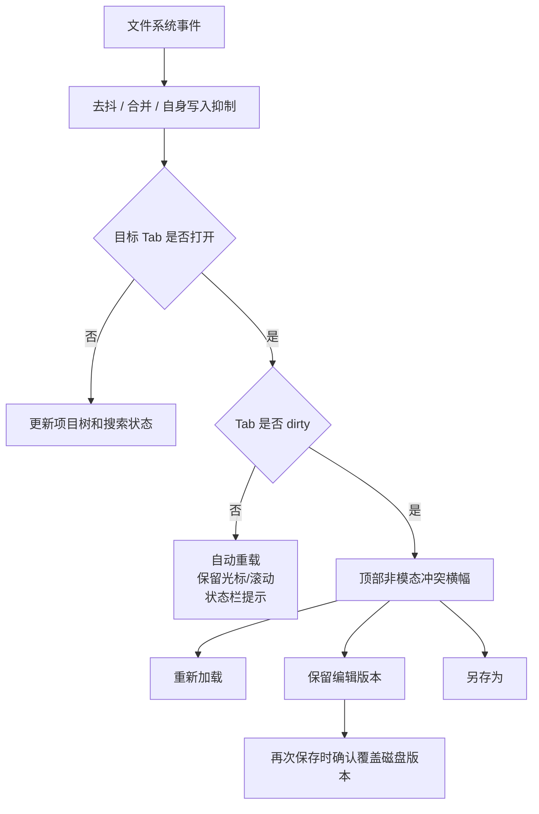
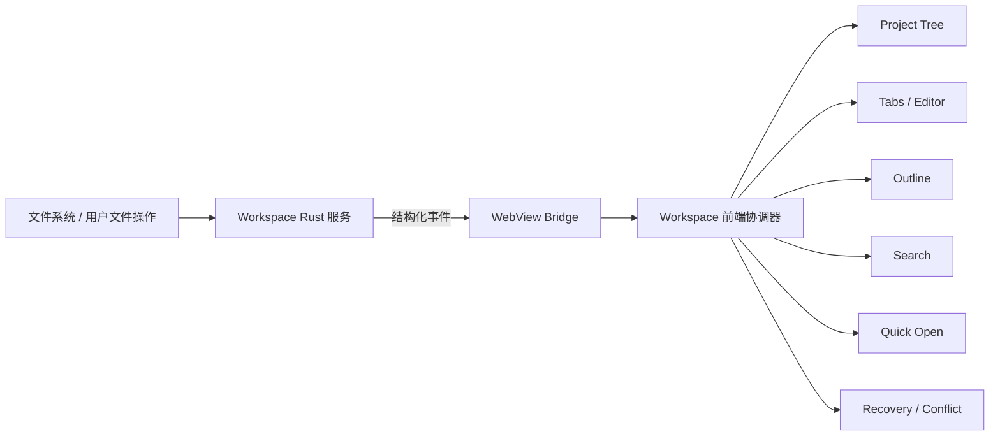

# GlanceMD Ultra 产品与架构方案

> 状态：现阶段调研与产品决策汇总稿  
> 日期：2026-08-29  
> 目标：保存现阶段共识，作为后续规格、架构设计和实施计划的唯一上层输入。

## 1. 执行摘要

最初的需求是给 GlanceMD 增加目录树，但确认范围已经扩展到：完整文件操作、文件监听与冲突、全文搜索、快捷打开、项目恢复、设置、可配置快捷键、命令面板、崩溃恢复和多窗口。

这已经不是 GlanceMD 的一个普通功能，而是一个新的产品层级。建议采用新产品名：

# **GlanceMD Ultra**

GlanceMD Ultra 的定位不是“更大的 GlanceMD”，而是：

> 面向本地 Markdown 与结构化文本项目的轻量原生工作区编辑器。

GlanceMD 继续保持“快速打开单个 Markdown、轻量查看与编辑”的核心定位；GlanceMD Ultra 面向目录型知识库、文档项目、技术写作仓库和本地文本工作流。



## 2. 产品关系建议

### 2.1 推荐：同源双产品，而不是立即完全分叉

短期内不建议复制仓库后各自演进。两个产品仍共享大量基础能力：

- Rust + wry + tao 窗口和 WebView。
- Markdown 编辑、预览、split、Outline。
- Tab、dirty、保存和最近文件。
- 主题与 Marco 排版。
- 三平台构建与发布流程。

推荐在同一仓库建立共享核心和两个产品入口：

```text
shared-core
├── editor / preview / tabs
├── file codec / atomic save
├── theme / commands
└── platform abstractions

GlanceMD
└── 单文件优先的轻量壳

GlanceMD Ultra
└── Workspace、项目树、监听、搜索、设置等完整壳
```

这样既能保住 GlanceMD 的轻量体验，也避免两份编辑器内核迅速漂移。

### 2.2 何时才拆成独立仓库

满足以下任一条件再考虑独立仓库：

- 两个产品发布节奏长期不同。
- Ultra 的依赖或体积目标开始明显拖累 GlanceMD。
- UI、数据模型、设置体系的共享比例低于约 50%。
- 维护者希望两个产品拥有独立 issue、roadmap 和品牌治理。

在首个 Ultra 稳定版本前，同仓多产品更安全。

## 3. 已确认的产品定位和边界

### 3.1 工作区

- 一个窗口只允许打开一个项目。
- 打开另一个项目时询问：新窗口打开或替换当前项目。
- 支持恢复上次项目、tab、活动文件、光标/滚动位置和树展开状态。
- 欢迎页与工具栏菜单均提供最近项目，支持固定项目和移除失效记录。
- 项目外单文件仍可独立打开；若文件属于当前项目则复用当前工作区。

### 3.2 项目树与 Outline

- 两者必须同时展示。
- 默认两个独立竖栏并排。
- 设置可切换为项目树在左、Outline 在右。
- 两个面板都支持折叠、拖宽和状态持久化。
- 项目树顶部提供“定位当前文件”：展开祖先、选中并滚动到活动文件。
- 切换 tab 只同步树高亮，不主动滚动。
- 1024px 窗口下仍需可操作；四块布局（项目树、Outline、编辑器、预览）必须有最小宽度和折叠约束。

### 3.3 文件类型和排除规则

默认可见并可编辑：

```text
.md .markdown .txt
.json .yaml .yml .toml .ini .csv
```

- 设置可切换为只显示 Markdown。
- 后续支持用户配置扩展名。
- 默认隐藏隐藏文件，设置可开启。
- 默认排除 `.git`、`node_modules`、`target`、`.venv`、`dist`、`build`、`.cache`。
- `files.exclude`、`search.exclude`、`files.watcherExclude` 全部可配置。
- 显示文件符号链接；默认不递归目录符号链接；文件操作不得越过项目根。
- 目标规模：10,000 文件以内不阻塞 UI。

## 4. 文件树与文件操作

### 4.1 必须能力

- 新建文件和文件夹。
- 内联重命名。
- Delete 移入系统回收站/废纸篓。
- Shift+Delete 永久删除并二次确认。
- 剪切、复制、粘贴。
- 拖放移动；Ctrl+拖放复制。
- 复制绝对路径和相对路径。
- 在系统文件管理器中显示。
- 在终端中打开。
- 手动刷新。
- 文件操作撤销：重命名、移动、可恢复删除；永久删除不可撤销。

### 4.2 多选

- 第一版支持 Ctrl/Shift 多选。
- 多选支持批量复制、移动、回收站删除和永久删除。
- 多选时禁用“在系统文件管理器中显示”，避免三平台多目标选择语义不一致。

### 4.3 已打开文件的一致性

文件操作必须是 Workspace 事务，而不是孤立 `fs` 调用。例如目录移动后，需要同步更新：

- 项目树路径。
- 所有受影响 tab 的路径、标题和保存目标。
- 最近文件。
- 活动文件高亮。
- 文件监听映射。
- 搜索结果。
- 恢复状态和窗口标题。

## 5. 文件监听与冲突策略

文件监听和自动刷新是核心能力，不是可选增强。



### 5.1 已确认行为

- Clean tab 外部修改：自动重载，尽量保留光标和滚动，状态栏短暂提示。
- Dirty tab 外部修改：禁止自动覆盖，显示顶部非模态横幅：
  - 重新加载；
  - 保留编辑版本；
  - 另存为。
- 选择保留编辑版本后，再次保存必须确认覆盖已变化的磁盘文件。
- 外部删除：保留内存内容，显示“磁盘文件已删除”，允许另存为或关闭。
- 外部移动：能唯一识别时更新路径；否则作为删除 + 新增处理。
- 短时间事件必须去抖、合并；应用自身保存和文件操作产生的事件需要抑制。
- “暂停监听”命令可以第二阶段交付。

## 6. 搜索与导航

### 6.1 全文搜索

- 搜索 Markdown 和受支持的文本文件。
- 后台执行、可取消、增量返回结果。
- 支持大小写敏感、全词、正则、包含/排除 glob。
- 限制结果数，跳过二进制和超大文件。
- 点击结果打开/切换 tab，跳到行列并选中匹配。
- split 下编辑器和预览同步定位。
- 第一阶段不做全项目替换；替换需要独立的预览、备份、冲突和撤销设计。

### 6.2 快速打开

- Ctrl+P 按文件名快速打开为必须能力。
- 文件索引来自 Workspace 文件清单，不应每次重新扫描磁盘。

## 7. 设置、快捷键和命令系统

### 7.1 设置

- 全局设置 + 项目设置，项目覆盖全局。
- 设置以独立 tab 展示：左侧分类、右侧设置项和搜索。
- 高级用户可打开设置 JSON。
- 设置 schema 必须带版本并支持迁移。
- 项目设置建议存放于 `.glancemd/settings.json`，是否自动创建由用户设置决定。

主要分类：

- 外观与布局。
- 文件类型、隐藏文件和排除规则。
- 文件监听与自动保存。
- 搜索。
- 编辑器与大文件模式。
- 快捷键。
- 恢复与启动行为。

### 7.2 快捷键

- 支持命令搜索、组合键录制、冲突检测、清除、恢复默认、导入/导出。
- 冲突时阻止保存，要求解决。
- Windows/Linux 显示 Ctrl/Alt，macOS 显示 Cmd/Option。

### 7.3 命令面板

- Ctrl+Shift+P 命令面板是必须能力。
- 文件树、编辑器、项目、搜索、布局、设置操作都通过统一命令注册表暴露。
- 菜单、按钮和快捷键只引用命令 ID，避免同一行为实现三次。

## 8. 保存、编码和数据保护

### 8.1 编码

当前 GlanceMD 使用 `fs::read_to_string()`，只支持合法 UTF-8；GBK 等编码会报错。

第一阶段：

- 支持 UTF-8 和 UTF-8 BOM。
- 保留原 LF / CRLF。
- 非 UTF-8 文件明确提示不支持。
- 不做静默错误解码。
- GBK、Big5、Shift-JIS 的检测和选择后置。

### 8.2 保存和恢复

- 改为原子保存：临时文件写入后替换目标。
- 自动保存默认关闭；支持延时和失焦模式。
- 崩溃恢复为必须能力：未保存内容写入恢复区，下次启动提示恢复。
- 切换项目或退出时，列出 dirty 文件，支持全部保存、逐个处理、全部放弃、取消。
- 超过默认 5 MB 的文件进入大文件模式，禁用实时预览、Outline 和高耗时功能；阈值可配置。

## 9. 推荐技术架构

### 9.1 Rust 后端

```text
src/
├── workspace/
│   ├── mod.rs              Workspace 生命周期和可信项目根
│   ├── tree.rs             懒加载目录树、过滤和符号链接策略
│   ├── operations.rs       新建/重命名/移动/复制/删除/撤销
│   ├── watcher.rs          监听、去抖、事件合并、自身事件抑制
│   ├── search.rs           后台搜索、取消和增量结果
│   ├── recovery.rs         崩溃恢复与会话恢复
│   └── settings.rs         设置 schema、合并与迁移
├── platform/
│   ├── reveal.rs           Explorer / Finder / xdg-open
│   ├── trash.rs            回收站 / 废纸篓
│   └── terminal.rs         在终端打开
├── file_codec.rs           UTF-8/BOM/换行元数据
└── atomic_save.rs          原子保存
```

### 9.2 前端

```text
src/frontend/
├── workspace.js            Workspace 会话和跨模块事件协调
├── project-tree.js         树、懒加载、多选、拖放和菜单
├── outline.js              从 app.js 拆出的 Outline 模块
├── search-panel.js         全文搜索 UI
├── quick-open.js           Ctrl+P
├── settings.js             设置 tab
├── keybindings.js          命令注册与快捷键
├── command-palette.js      Ctrl+Shift+P
├── recovery.js             冲突、删除和崩溃恢复 UI
└── tabs.js                 保持文档 tab 单一职责
```

### 9.3 事件模型



核心事件建议：

```text
workspace:opened / workspace:closed
workspace:file-created
workspace:file-changed
workspace:file-renamed
workspace:file-moved
workspace:file-deleted
workspace:active-file-changed
workspace:scan-progress
workspace:watcher-error
workspace:search-result / search-completed / search-cancelled
```

Rust 负责文件系统真实状态和可信边界；JS 负责 UI 状态。任何文件变更都通过 Workspace 事件协调，不允许树、tab、搜索各自猜测磁盘状态。

## 10. 分阶段交付计划

| 阶段 | 交付内容 | 依赖 | 单人估算 |
|---|---|---|---:|
| 0. 架构地基 | 命令注册表、Workspace IPC、可信根、异步事件桥 | 无 | 1–2 周 |
| 1. 项目浏览 | 打开目录、恢复项目、懒加载树、多选、双布局、定位当前文件、Ctrl+P | 阶段 0 | 2–3 周 |
| 2. 监听与冲突 | watcher、去抖、自身事件抑制、自动重载、冲突横幅、外部删除 | 阶段 1 | 1.5–2.5 周 |
| 3. 文件操作 | 新建/重命名/复制/移动、回收站、永久删除、撤销、右键菜单、终端/reveal | 阶段 2 | 2–3 周 |
| 4. 搜索 | 后台全文搜索、取消、增量结果、过滤、结果跳转 | 阶段 1–2 | 1.5–2 周 |
| 5. 设置与快捷键 | 设置 tab、项目覆盖、快捷键录制/冲突、命令面板 | 阶段 0 | 2–3 周 |
| 6. 数据保护 | 原子保存、自动保存模式、崩溃恢复、UTF-8 BOM/换行、大文件模式 | 阶段 2–5 | 1.5–2.5 周 |
| 7. 稳定与发布 | 10k 文件性能、三平台手工验证、迁移、文档、安装与 Release | 全部 | 2–3 周 |

阶段存在并行空间，但单人串行的推荐正式发布周期约 **10–14 周**；若对完整边缘情况和三平台成熟度要求高，应按 **3–6 个月**规划。

## 11. 成功标准

- 三平台均能打开项目、监听、文件操作和搜索。
- 外部修改在 clean/dirty 两种状态下都不会丢数据。
- Delete / Shift+Delete 与 Windows 文件管理器语义一致。
- 10,000 文件项目扫描、搜索、监听不阻塞 UI。
- 默认并排布局和 Outline 右侧布局均可用，并与 split 共存。
- 1024px 宽窗口仍可操作。
- Ctrl/Shift 多选与批量文件操作可用；多选时 reveal 禁用。
- 设置可迁移，快捷键冲突可检测并恢复默认。
- 崩溃后可恢复未保存内容。
- GlanceMD 的单文件快速启动与轻量体验不因 Ultra 功能退化。

## 12. 主要风险

1. **产品边界失控**：Ultra 很容易继续向完整 IDE 扩张，必须坚持“本地文本工作区”定位。
2. **共享核心漂移**：若过早复制仓库，两个编辑内核会快速分叉。
3. **数据损失**：监听、dirty、移动、删除、自动保存组合必须以恢复和冲突测试为门禁。
4. **UI 拥挤**：默认两竖栏 + split 对小窗口压力大，折叠和宽度约束不可后补。
5. **跨平台差异**：回收站、reveal、终端、文件锁和重命名事件语义不完全一致。
6. **体积目标变化**：允许 2–5 MB，但必须监控依赖；仍不采用 Electron/Monaco 全家桶。

## 13. 当前明确非目标

- 第一阶段不支持 GBK/Big5/Shift-JIS。
- 第一阶段不做全项目替换。
- 不采用 Monaco 或 Electron。
- 不保证 Linux 文件管理器选中文件，只保证打开父目录。
- 不做多根工作区；一个窗口一个项目。
- 不把 GlanceMD Ultra 定位为代码 IDE。

## 14. 下一步

1. 确认采用“同仓共享核心 + GlanceMD Ultra 产品入口”的产品结构。
2. 为阶段 0–1 写正式 OpenSpec/技术规格。
3. 先做架构地基和项目树垂直切片，不同时启动所有功能。
4. 项目树垂直切片完成后，用真实 10k 文件目录验证性能，再锁定 watcher/search 技术方案。

本文件代表现阶段已确认方案。后续若出现新决策，应追加 ADR 或更新本文件的“决策变更记录”，避免实施计划和产品共识漂移。
